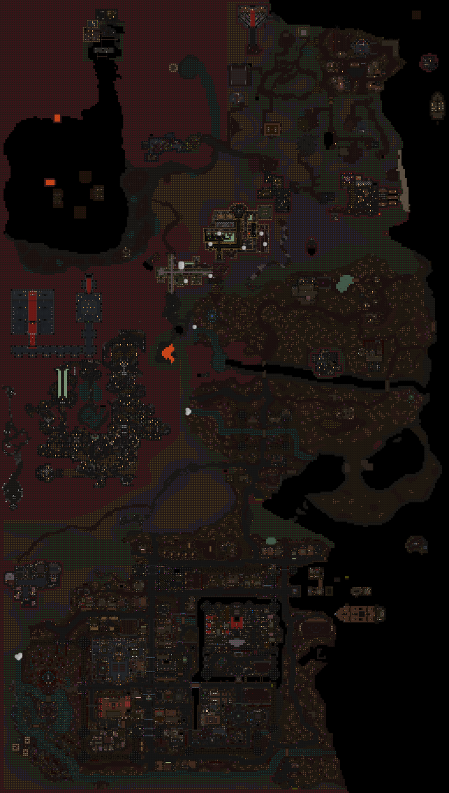

# dun_world — Interactive Map Viewer

A scroll/zoom (pan-and-zoom) viewer for the full sprite render of `dun_world`,
the live Azure-Peak map. Drag to scroll, wheel/pinch to zoom, switch between the
four z-levels, and click pins to fly to points of interest.



## How to open it

The viewer loads tiles over HTTP, so it must be **served**, not opened as a
`file://` (browsers block the tile/JSON fetches otherwise).

- **GitHub Pages:** enable Pages for this repo (Settings → Pages → deploy from
  branch, `/docs` folder). The viewer is then live at
  `https://<user>.github.io/<repo>/map-viewer/`.
- **Locally:** from the repo root run a static server and open the page:
  ```sh
  python3 -m http.server 8000
  # then visit http://localhost:8000/docs/map-viewer/
  ```

## Controls

- **Drag** to scroll, **scroll-wheel / pinch** to zoom, **double-nothing** — it
  won't zoom on click so pins stay clickable.
- **z-level buttons** (top-left): `z2` surface/town · `z3` mountains/bog ·
  `z4` high ground · `z1` underground.
- **Pins toggle** turns the POI markers on/off.
- **Points-of-interest panel** (top-right) lists the pins on the current level;
  click one to fly to it. Pins also show a label on hover.

### Pinned points of interest
| Pin | Level |
|-----|-------|
| The House of the Ten (church), the Inquisition manor, the Sacred Tree of Dendor, the druid's-grove & SE-woods Heartroots | z2 |
| The Mossmother (root hub) and the south-bog Heartroot | z3 |
| The mountain, hot-springs and beach-forest Heartroots | z4 |

## What's in here

```
index.html              OpenSeadragon viewer (CDN, no build step)
pois.json               point-of-interest pin coordinates, per z-level
dun_world-z{1..4}.dzi   Deep Zoom descriptors
dun_world-z{1..4}_files/ WebP tile pyramids
```

## How it was generated

1. The map was rendered to PNG with **SpacemanDMM's `dmm-tools minimap`** against
   `roguetown.dme` (one image per z-level, native 32 px/tile).
2. Each render was downscaled to 4080×7200 and sliced into a **WebP Deep Zoom
   (DZI)** tile pyramid (1024 px tiles, quality 80).
3. **OpenSeadragon** (loaded from CDN) serves the pan/zoom UI; `pois.json`
   coordinates were extracted straight from the `.dmm`.

The tiles are **half the native sprite resolution** to keep the repo footprint
small (~26 MB vs ~150 MB at full res). To regenerate at full 1:1 resolution,
re-run the DZI generator against the original 8160×14400 renders.
